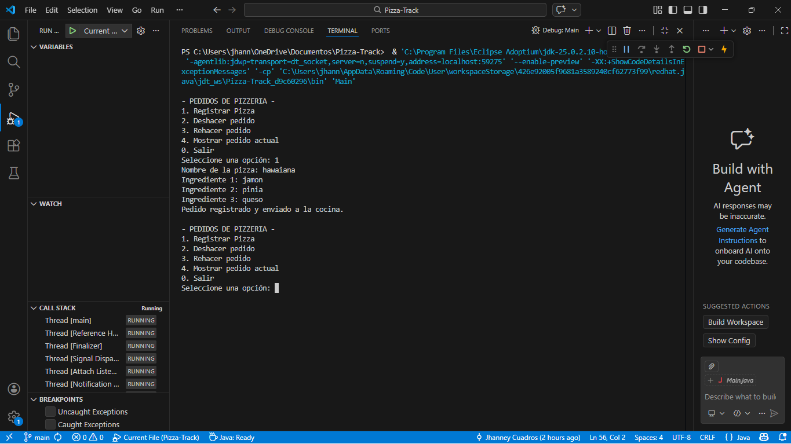
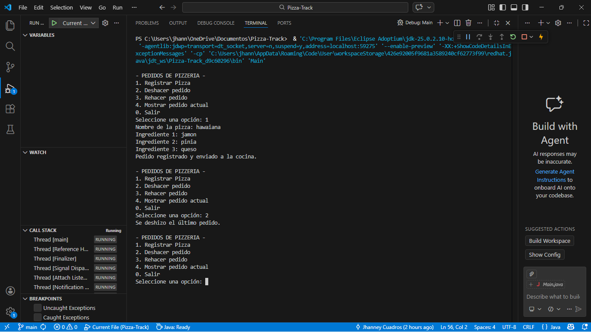
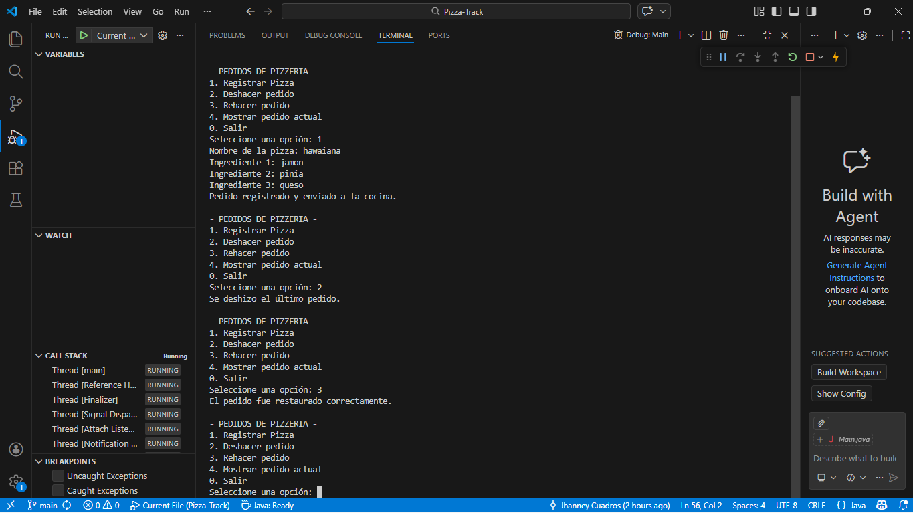

# Sistema de Gestión de Pedidos de Pizzería (Pizza-Track)

## Objetivo
El objetivo de este proyecto es comprender el funcionamiento de la estructura de datos **pila (stack)** mediante la implementación de un sistema sencillo de gestión de pedidos de una pizzería en Java.

## ¿Qué es una pila?
Una pila es una estructura de datos que funciona bajo el principio **LIFO (Last In, First Out)**, que significa que el último elemento que entra es el primero que sale.

Las pilas se utilizan en muchos sistemas informáticos, por ejemplo en funciones de **Deshacer (Undo)** y **Rehacer (Redo)**.

## Aplicación en el proyecto
En este programa se simula un sistema de pedidos de pizzas donde:

- Cuando se registra una pizza, se guarda en la **pila principal**.
- Si se usa la opción **Deshacer**, el último pedido se retira de la pila principal.
- Ese pedido se guarda en una **pila secundaria**.
- Si se usa **Rehacer**, el pedido vuelve nuevamente a la pila principal.

De esta manera se simula el comportamiento de Undo y Redo.

## Funcionalidades del programa

El sistema permite las siguientes opciones en consola:

1. Registrar una pizza con su nombre y 3 ingredientes.
2. Deshacer el último pedido registrado.
3. Rehacer un pedido que fue deshecho.
4. Mostrar el pedido actual en la parte superior de la pila.

## Tecnologías utilizadas

- Java
- Visual Studio Code
- Git
- GitHub

## Autor

Jhanney Antonio Cuadros Ramos

## Ejecución del programa

### Registro de pizza

### Deshacer pedido

### Rehacer pedido
